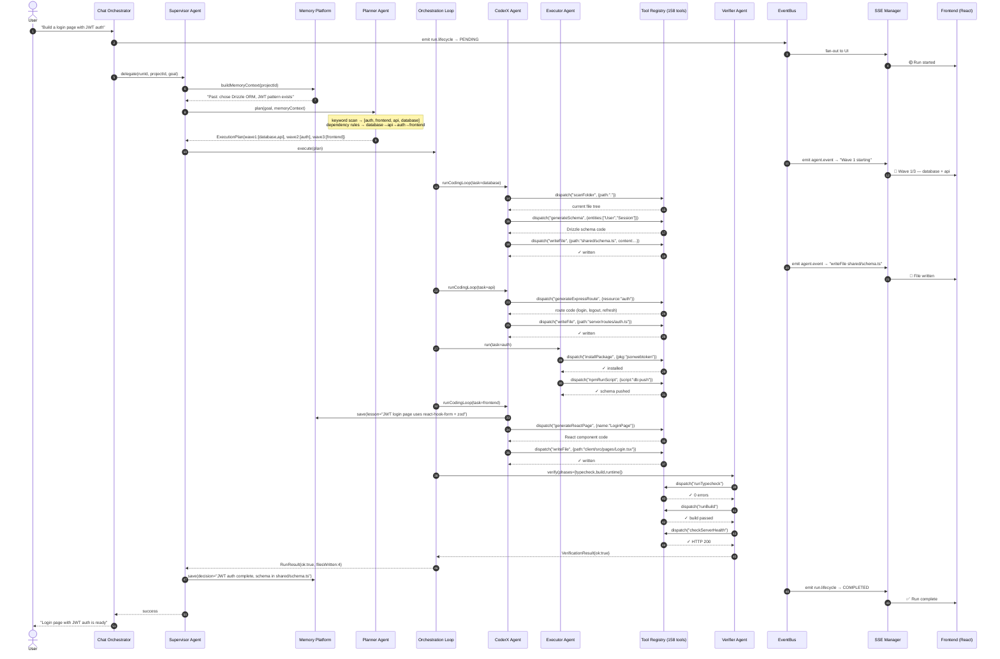
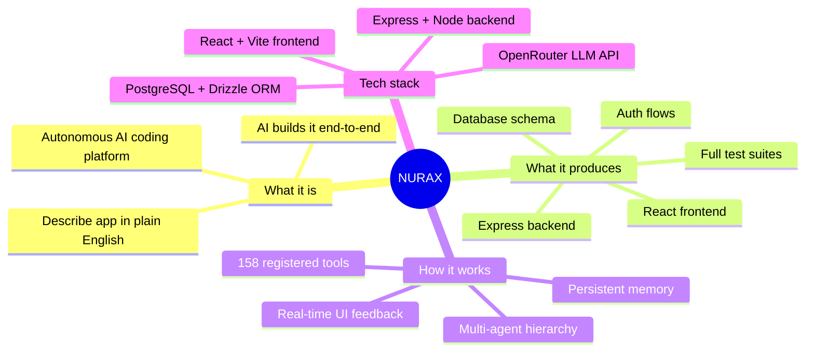
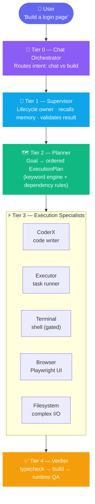
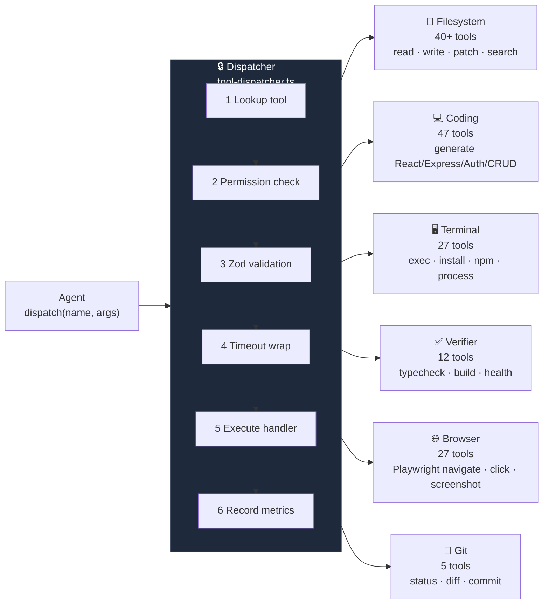
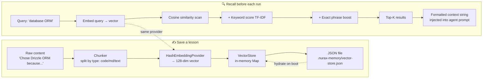
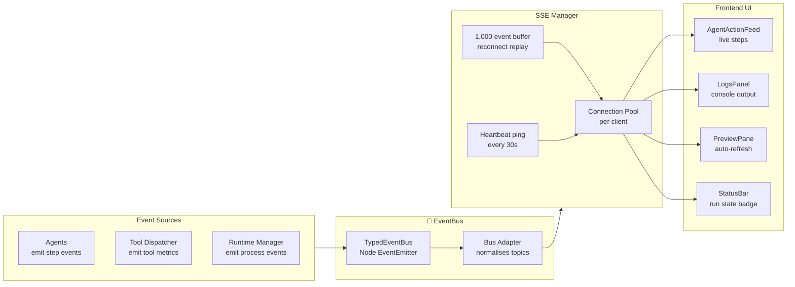
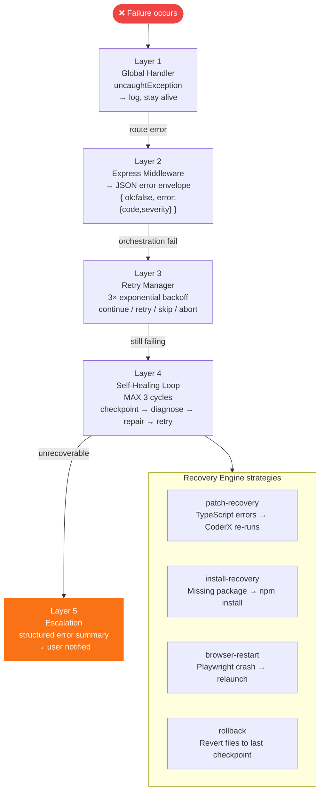
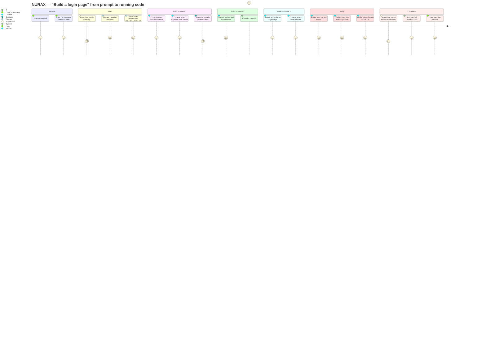

# NURAX — System Architecture Diagrams

> Mermaid diagrams: real-time work log, full architecture, and slide-ready breakdowns.

---

## 1. Real-Time Work Log — What the AI Does Step by Step

---

## 2. Workflow Architecture Diagram — How All Components Connect

```mermaid
flowchart TD
    subgraph CLIENT["🖥️ Frontend — React + Vite (port 5000)"]
        UI_CHAT["ChatPanel\n(user input)"]
        UI_FEED["AgentActionFeed\n(live steps)"]
        UI_LOGS["LogsPanel\n(console output)"]
        UI_PREV["PreviewPane\n(iframe :sandbox-port)"]
        UI_FILES["FileExplorer\n(project tree)"]
        SSE_HOOK["useRealtimeFeed()\nSSE subscriber"]
    end

    subgraph PROXY["Vite Proxy (/api → :3001)"]
        VITE_PROXY["proxy: /api /sse /events /ws /preview"]
    end

    subgraph SERVER["⚙️ Backend — Express (port 3001)"]

        subgraph ENTRY["Entry Layer"]
            HTTP["Express App\nmain.ts"]
            CO["Chat Orchestrator\nchat-orchestrator.ts"]
            WS["WebSocket Server"]
        end

        subgraph AGENTS["🤖 Agent Hierarchy"]
            SV["Supervisor Agent\nlifecycle owner"]
            PL["Planner Agent\ngoal → ExecutionPlan"]
            OL["Orchestration Loop\nwave executor"]
            CX["CoderX Agent\ncode generation"]
            EX["Executor Agent\ntask runner"]
            TA["Terminal Agent\nshell (gated)"]
            FA["Filesystem Agent\ncomplex I/O"]
            BA["Browser Agent\nPlaywright automation"]
            VR["Verifier Agent\ntypecheck+build+runtime"]
        end

        subgraph TOOLS["🔧 Tool Registry (sealed at boot)"]
            TD["tool-dispatcher.ts\ndispatch(name, args, ctx)"]
            TFS["Filesystem Tools\n40+ tools"]
            TCO["Coding Tools\n47 tools"]
            TTE["Terminal Tools\n27 tools"]
            TVE["Verifier Tools\n12 tools"]
            TBR["Browser Tools\n27 tools"]
            TGI["Git Tools\n5 tools"]
        end

        subgraph MEMORY["🧠 Memory Platform"]
            MR["Memory Repository\nread/write orchestrator"]
            VS["VectorStore\nin-memory Map"]
            HE["HashEmbeddingProvider\n128-dim local vectors"]
            CH["Chunker\ncode/md/json/text"]
            PS["Persistence Adapter\n.nurax-memory/vector-store.json"]
        end

        subgraph EVENTS["📡 Observability"]
            EB["TypedEventBus\nNode EventEmitter"]
            BA_SSE["Bus Adapter\nnormalises events"]
            SM["SSE Manager\nfan-out to clients\n1000-event buffer"]
            TM["Tool Metrics\ninvocations/failures/latency"]
            ET["Execution Timeline\nappend-only audit log"]
        end

        subgraph INFRA["🗄️ Infrastructure"]
            DB["PostgreSQL\nvia Drizzle ORM"]
            REDIS["Redis / BullMQ\njob queue (optional)"]
            SB["Sandbox\n.sandbox/{project-slug}"]
            RM["Runtime Manager\nmanaged child processes"]
        end

        subgraph ERRORS["🛡️ Error & Recovery"]
            GH["Global Handlers\nuncaughtException"]
            EM["Express Middleware\nerror serialiser"]
            RTY["Retry Manager\n3× exponential backoff"]
            SHL["Self-Healing Loop\nMAX 3 heal cycles"]
            RCE["Recovery Engine\nclassify + repair plan"]
            RBK["Rollback Manager\ncheckpoint + revert"]
        end
    end

    subgraph AI["🌐 AI Layer"]
        OR["OpenRouter API\nhttps://openrouter.ai"]
        LLM["LLM\nopenai/gpt-oss-120b:free"]
    end

    subgraph HEALTH["🔬 Health"]
        HD["Startup Diagnostics\nenv checks on boot"]
        RHM["Runtime Health Monitor\n60s sweep, stuck-session detect"]
    end

    %% Client → Server
    UI_CHAT -->|POST /api/chat| VITE_PROXY
    UI_FILES -->|GET /api/file-explorer| VITE_PROXY
    SSE_HOOK -->|GET /api/realtime| VITE_PROXY
    VITE_PROXY --> HTTP

    %% Server entry
    HTTP --> CO
    CO -->|build intent| SV
    CO -->|chat intent| LLM

    %% Agent hierarchy
    SV --> PL
    SV --> OL
    OL --> CX
    OL --> EX
    EX --> TA
    EX --> FA
    EX --> BA
    OL --> VR

    %% All agents → tools via dispatcher
    CX -->|dispatch| TD
    EX -->|dispatch| TD
    TA -->|dispatch| TD
    BA -->|dispatch| TD
    VR -->|dispatch| TD
    TD --> TFS & TCO & TTE & TVE & TBR & TGI

    %% Memory
    SV -->|buildMemoryContext| MR
    CX -->|save lesson| MR
    MR --> HE --> VS
    MR --> CH
    VS <--> PS
    MR --> DB

    %% Events
    SV & CX & EX & VR & OL -->|emit| EB
    EB --> BA_SSE --> SM
    SM -->|SSE stream| SSE_HOOK
    SSE_HOOK --> UI_FEED & UI_LOGS & UI_PREV

    %% Tool metrics
    TD --> TM
    CX --> ET

    %% LLM
    TCO -->|CodeGen prompt| OR --> LLM
    LLM -->|JSON response| TCO
    CO -->|chat messages| OR

    %% Infra
    TFS --> SB
    TTE --> RM
    RM --> SB
    MR --> DB
    OL --> REDIS

    %% Error
    HTTP --> EM
    OL --> RTY
    EX --> SHL
    SHL --> RCE --> RBK
    RBK --> SB

    %% Health
    HD --> HTTP
    RHM --> EB
```

---

## 3. Slide-Ready Breakdown

---

### Slide 1 — What is NURAX?

---

### Slide 2 — The 5-Tier Agent Hierarchy

---

### Slide 3 — The Tool Registry (158 Tools, Sealed at Boot)

---

### Slide 4 — Memory Platform (How the AI Remembers)

---

### Slide 5 — Real-Time Observability Pipeline

---

### Slide 6 — Error Recovery Ladder

---

### Slide 7 — End-to-End Request Lifecycle

