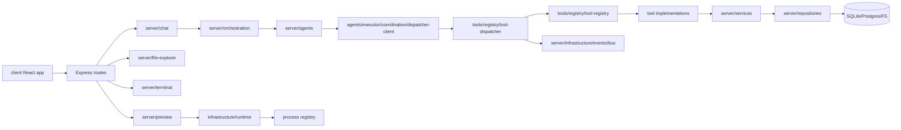
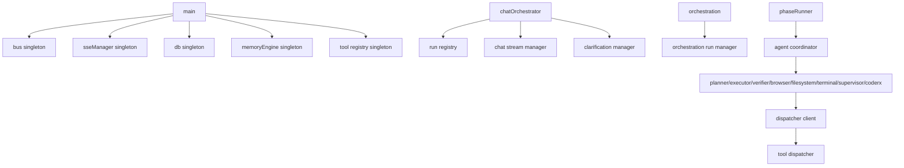
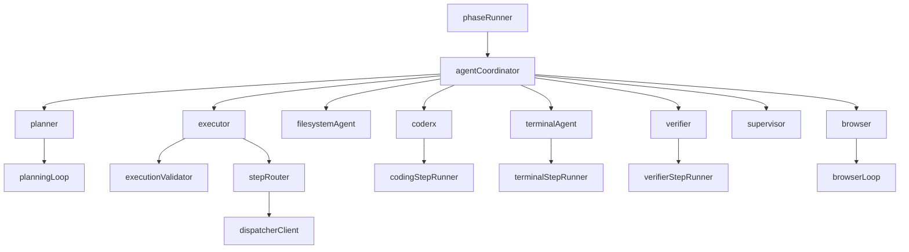
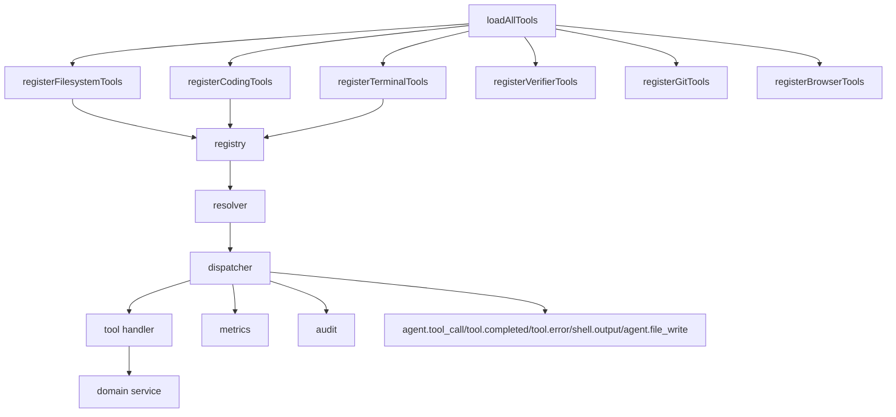
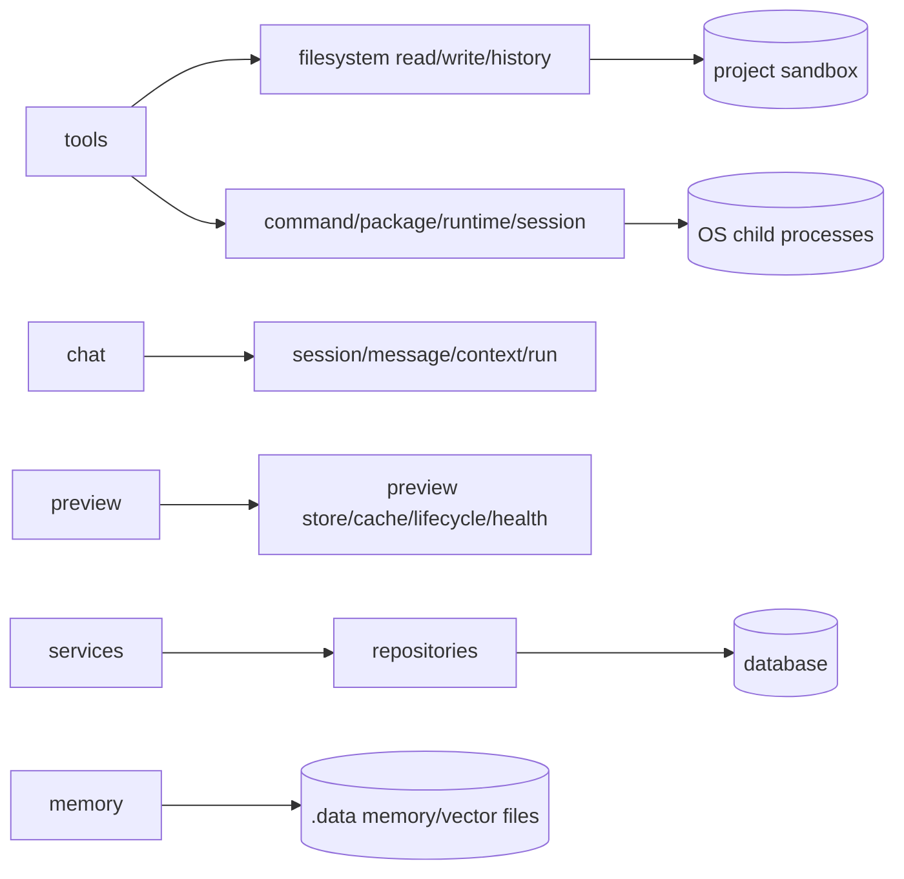
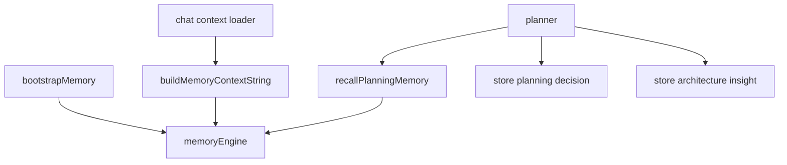
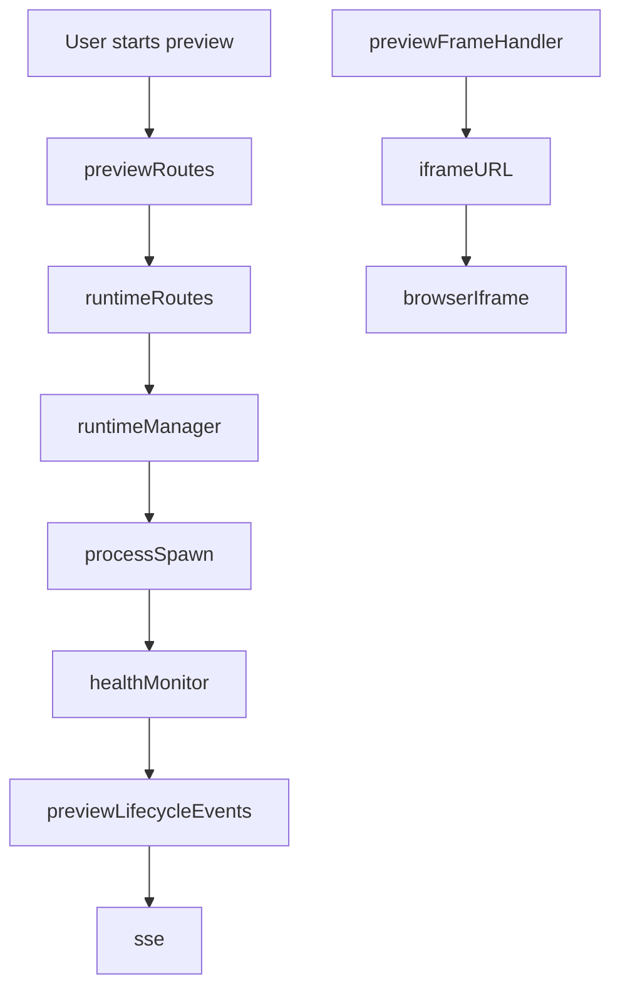
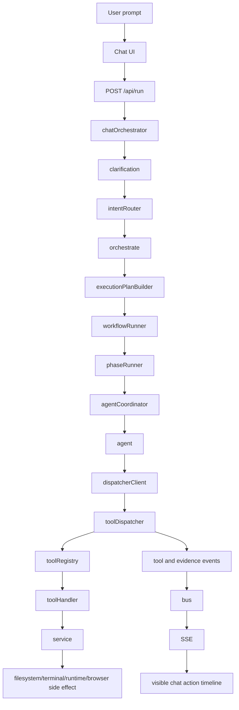
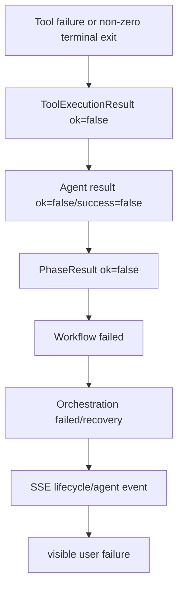

# NURAX System Intelligence and Recovery Report

## System purpose
NURAX is a browser-based autonomous app-building platform. The frontend sends a user goal to the chat/run API, the server routes that goal through chat clarification and orchestration, orchestration dispatches phases to in-process agents, agents invoke the central tool dispatcher, tools produce filesystem/terminal/runtime/browser side effects inside the project sandbox, and infrastructure events fan out over SSE so the UI can show real execution activity.

## Bootstrap graph
```mermaid
graph TD
  main[main.ts] --> errors[global error handlers]
  main --> infra[registerInfrastructure]
  infra --> busAdapter[initBusAdapter(bus)]
  infra --> seed[seedDefaultProject]
  main --> repos[registerRepositories - singleton import warmup]
  main --> services[registerServices]
  services --> memory[bootstrapMemory]
  services --> tools[loadAllTools]
  tools --> fsTools[filesystem tools]
  tools --> codeTools[coding tools]
  tools --> termTools[terminal tools]
  tools --> verifierTools[verifier tools]
  tools --> gitTools[git tools]
  tools --> browserTools[browser tools]
  tools --> seal[sealRegistry]
  main --> routes[registerRoutes]
  routes --> realtime[/api/realtime SSE]
  routes --> chat[/api/chat + /api/run]
  routes --> files[file explorer]
  routes --> terminal[terminal router]
  routes --> preview[preview/runtime routers]
  main --> http[startHttpServer]
```

## Dependency / import / export graph


Public API surfaces are the module `index.ts` files for infrastructure, tools registry, chat, orchestration, agents, preview, terminal, and file explorer. The critical dependency rule is one-way execution routing: orchestration → agents → executor dispatcher gateway → tool dispatcher → registry/tool implementations. Tool dispatcher imports only the event bus submodule for telemetry to avoid pulling the entire infrastructure barrel into the tool layer.

## Dependency injection graph


## Runtime graph
```mermaid
graph TD
  runtimeRoutes[/api/runtime/:projectId/start|restart|stop] --> runtimeManager[preview/runtime manager]
  terminalStart[terminal_start_runtime tool] --> runtimeService[terminal runtime service]
  runtimeService --> processStore[process store]
  runtimeManager --> childProcess[child process]
  childProcess --> health[runtime health monitor]
  health --> port[port discovery]
  port --> previewFrame[/preview frame/proxy]
  runtimeEvents[runtime/preview events] --> bus
  bus --> sse[SSE fan-out]
```

## Agent graph


## Tool graph


## Service / repository / persistence graph


## Memory graph


Memory participates as contextual input to chat and planner decisions, then stores post-plan decision/architecture records. It is advisory; tool execution does not depend on memory writes succeeding.

## Event bus and SSE graph
```mermaid
graph TD
  publishers[chat/orchestration/tools/file/preview publishers] --> bus[TypedEventBus]
  bus --> sseManager[sse-manager bus listeners]
  sseManager --> topicAgent[agent topic]
  sseManager --> topicLifecycle[lifecycle topic]
  sseManager --> topicCheckpoint[checkpoint topic]
  realtimeRoute[/api/realtime] --> sseManager
  clientProvider[RealtimeProvider] --> eventSource[EventSource /api/realtime]
  eventSource --> topicHandlers[topic handlers]
  topicHandlers --> chatHandler[buildAgentHandler]
  chatHandler --> streamHandler
  chatHandler --> toolHandler
  chatHandler --> planHandler
  chatHandler --> messageHandler
```

## Preview graph


## End-to-end execution graph


## Failure propagation graph


## First failure point
The earliest execution-invalid point found in this recovery pass was agent sandbox root resolution. The chat orchestrator resolved a per-project sandbox and passed it into orchestration, but `invokeAgent` preferred only `input.sandboxRoot`, then `AGENT_PROJECT_ROOT`, then `.sandbox`. Phases whose input did not redundantly carry `sandboxRoot` could plan/execute against a different workspace from the orchestration context. That invalidates all downstream reality checks because file writes, command cwd, package installs, runtime starts, and preview validation can target different roots.

## Root causes and fixes applied
1. **Workspace routing root cause**: agent invocation did not inherit the orchestration context sandbox. **Fix**: agent sandbox resolution now falls back to `context.sandboxRoot` before environment/global defaults.
2. **Fake failure-message root cause**: `success:false` with an empty `errors` array produced an empty string instead of a useful failure reason. **Fix**: failure normalization now uses non-empty `error || errors || fallback`.
3. **Tool evidence root cause**: dispatcher evidence readers only inspected the outer object. Tool handlers that returned a `ToolExecutionResult` envelope could hide `data.exitCode`, `data.output`, or file-write data from event emission/reality checks. **Fix**: dispatcher evidence helpers unwrap successful tool envelopes before terminal reality checks and event publication.
4. **Action visibility root cause**: shell output was only attached to legacy names (`shell.exec`, `shell_exec`, `console.run`) while registered terminal tools are named `terminal_*`. **Fix**: chat tool handling now keys shell output by payload tool and accepts registered terminal tool names.
5. **Layering root cause**: the dispatcher imported the infrastructure barrel solely to get the bus, coupling tool execution to unrelated infrastructure exports. **Fix**: dispatcher imports the bus submodule directly.

## Remaining risks
- Full TypeScript validation is blocked in this environment because `npm install` cannot fetch `zod-validation-error@5.0.0` from the configured package firewall.
- The npm test script currently matches no tests, so it proves command wiring but not behavior coverage.
- Runtime/preview end-to-end verification requires a completed dependency install and a real browser/runtime session.
- Several routes still expose stub success endpoints (`/api/run-project`, `/api/stop-project`, `/api/artifacts`), which can create future fake-success paths if the UI depends on them for actual execution.

## Readiness scores
- Stability score: 72/100 after this patch.
- Reliability score: 68/100 because dependency installation and full typecheck remain blocked externally.
- Production readiness: 61% until package install, typecheck, real runtime preview, and behavioral tests pass in an unrestricted environment.
